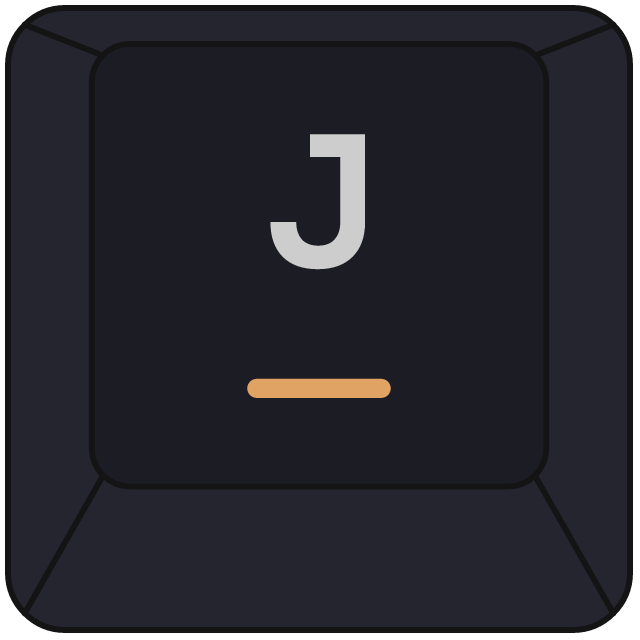

<div align="center">

  <h1>Jari</h1>
</div>

**Jari** _/ja·ri/_ - simple keyboard-driven navigation for modern browsers.
Scroll, tabs, history, link hints, find in page, and text selection
without leaving the home row.

Chrome, Edge, and Firefox (Manifest V3). No data collection -
see [PRIVACY.md](PRIVACY.md).

## Keys

Commands take a repeat count (`3j`, `2x`); `0-9` are reserved for it.
Bindings chain into sequences of any length.

- Scroll: `j`/`k`/`h`/`l`, `d`/`u` half page, `gg`/`G` top/bottom, `w` cycle scroll area,
  `;w` reset scroll area
- Zoom: `+`/`=`/`-`
- Tabs: `t` URL/search (`t ` lists all open tabs, `t ` + query searches them), `T` incognito, `x`/`X` close/reopen,
  `J`/`K` prev/next, `g0`/`g$` first/last, `<<`/`>>` move, `W` move to window,
  `gp`/`gP` open clipboard here/background
- History: `H`/`L` back/forward
- Page: `r`/`R` reload/hard reload, `gu`/`gU` parent/root, `ge` edit URL,
  `yy` copy URL, `Y` copy title + URL, `[[`/`]]` previous/next page
  (customizable link texts in settings)
- Hints: `f` click, `F` new tab, `gf` background tab, `i` focus input, `yf` copy link URL, `yF` copy link text
- Find: `/` find, `n`/`N` next/prev (smart case, `Esc` hides highlights with `n` to resume, `Enter` follows;
  rebindable toggles `alt+1` regex, `alt+2` whole word, `alt+3` case;
  `Up`/`Down` history)
- Visual: `v`/`V` visual/line mode (`h`/`j`/`k`/`l`, `w`/`b`/`e`, `0`/`^`/`$`,
  `G`/`gg`, `f`/`F`/`t`/`T` + char, `o` swap; `y` yank)
- Modes: `I` ignore, `p` passthrough, `ctrl+alt+v` disable on site
- Help: `?` cheatsheet, `;e` settings, `;x` extensions page

Unbound by default (bind them in settings): scrollPageDown/Up,
newTab, newIncognitoTab, duplicateTab, togglePin,
toggleMute, hintOpenCurrent, toggleBookmark.

## Settings (`;e`)

Open with `;e`. Everything above is rebindable; press `Enter` to save a
binding. Overlapping bindings are allowed but flagged - the single key
fires first.

Hints offers themes, label size, and an extra clickable selector; disabled
sites accept `*.example.com` wildcards. Search offers a default engine plus
custom `keyword query` engines (`g`, `yt`, `gh`, `wiki`, `r` built in).

## Install

Download the latest `jari-chrome-<version>.zip` or `jari-firefox-<version>.zip`
from [Releases](https://github.com/bymaul/jari/releases), unzip it, then:

- Chrome/Edge: `chrome://extensions` → Developer mode → Load unpacked.
- Firefox: `about:debugging#/runtime/this-firefox` → Load Temporary Add-on →
  select `manifest.json` (temporary add-ons vanish on restart; signed store
  builds are planned.)

Or build from source (below) and load this folder the same way. The checked-in
`manifest.json` targets Chrome - run `npm run build:firefox` first for Firefox.

## Permissions

| Permission                  | Used for                                                                              |
| --------------------------- | ------------------------------------------------------------------------------------- |
| `tabs`, `sessions`          | Switch, close, reopen, move, duplicate tabs                                           |
| `history`, `bookmarks`      | Omnibox (`t`) suggestions from your history and bookmarks                             |
| `storage`                   | Persist your settings via the browser's synced storage                                |
| `clipboardRead`             | Open a URL from your clipboard (`gp`/`gP`)                                            |
| `clipboardWrite`            | Copy URL / title (`yy`, `Y`, `yf`) - Firefox only; Chrome uses the page clipboard API |
| `<all_urls>` content script | Link hints, scrolling, find, and visual mode on the pages you visit                   |

Jari makes no network requests of its own and sends nothing anywhere.
Details in [PRIVACY.md](PRIVACY.md).

## Build & dev

```sh
npm install
npm run lint          # eslint, must be clean
npm test              # node --test
npm run build:chrome  # or: npm run build:firefox
npm run dist          # release zips for both targets under dist/
```

Source in `content/`, `options/`, `background/`, `shared/` is bundled by
esbuild into `content/bundle.js`, `options/options.bundle.js`,
`background.js` - rebuild after changing source and commit both together.

See [CHANGELOG.md](CHANGELOG.md) for release history.

## Support & contributing

- Bug reports and feature requests:
  [GitHub Issues](https://github.com/bymaul/jari/issues). Include browser +
  version, Jari version, page URL (if public), and keys pressed.
- Security issues: private
  [security advisory](https://github.com/bymaul/jari/security/advisories/new).
- Pull requests welcome: keep changes small, run `npm run lint` and
  `npm test`, and rebuild the bundles before committing.

## License

[MIT](LICENSE)
